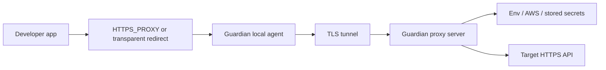

# Guardian Architecture

Guardian splits secret-aware traffic handling into a central proxy server and a lightweight local agent.

## Components

| Component | Runs Where | Responsibility |
| --- | --- | --- |
| Proxy server | Shared server or gateway | Auth, MITM, secret resolution, injection, audit logging, optional admin panel |
| Local agent | Developer machine | Local proxy, transparent interception, tunnel transport, health endpoint |
| Secret providers | Server-side only | Resolve secrets from environment variables, AWS Secrets Manager, or stored secrets |

## Traffic Modes

## 1. Explicit proxy mode

Applications set `HTTPS_PROXY=http://127.0.0.1:19080`.

Flow:

1. The application opens an HTTP CONNECT tunnel to the local agent.
2. The local agent decides whether the destination domain should use the tunnel.
3. Matching domains are forwarded as framed tunnel traffic to the proxy server.
4. The proxy server performs MITM, scans headers for `__PLACEHOLDER__` tokens, resolves secrets, injects them, and forwards the request upstream.
5. The response is streamed back through the same path.

## 2. Transparent interception mode

Applications do not need per-process proxy configuration.

Flow:

1. The operating system redirects outbound HTTPS traffic to the local agent's transparent listener.
2. The agent peeks at the TLS ClientHello and extracts the SNI hostname.
3. It checks the server-provided domain list:
   - matching domains go through the tunnel
   - non-matching domains go directly to the target
4. The proxy server handles tunneled traffic the same way as explicit proxy mode.

Windows supports `auto`, `windivert`, and `system_proxy` interception methods. Linux uses trust-store installation plus `iptables` and `ip6tables` redirection to the transparent TLS listener for outbound IPv4 and IPv6 HTTPS traffic, and excludes root-owned client processes to avoid tunnel loops.

## 3. Local-only mode

If the proxy server runs on the same machine as the client, you can skip the local agent and point `HTTPS_PROXY` directly at the proxy server.

This is useful for fast evaluation and CI smoke testing, but the tunnel-based model is the intended multi-machine deployment shape.

## Secret Injection Model

Guardian only injects secrets server-side.

- Clients send placeholder values such as `Authorization: Bearer __OPENAI_API_KEY__`.
- The proxy scans headers for placeholders.
- Each configured secret declares `allowedDomains`.
- If the request hostname is allowed, the proxy resolves the real secret and replaces the placeholder.
- If the hostname is not allowed, the placeholder is removed instead of injected.

This domain binding is one of the main protections against secret exfiltration.

## Tunnel Protocol

The local agent and the proxy server communicate over a framed TLS tunnel.

- The tunnel multiplexes many proxied connections over one authenticated TLS session.
- The control channel handles auth, heartbeat, and domain-list updates.
- Both implementations must stay aligned:
  - `proxy-server/src/tunnel/protocol.ts`
  - `local-agent/src/tunnel/protocol.rs`

## Authentication

Guardian uses the same logical client identity for both CONNECT proxy auth and tunnel auth.

- Proxy-server client record: `machineId` + `token`
- Local-agent config: `auth.machine_id` + `auth.token`

The local agent authenticates with an `AUTH` frame. Direct proxy clients authenticate with Basic auth in the proxy URL.

## Performance And Routing Notes

- The proxy server prefers upstream HTTP/2 when the target supports it and falls back to HTTP/1.1 otherwise.
- The local agent keeps a domain filter so non-matching traffic can bypass the tunnel entirely.
- Upstream connection pooling and TLS session reuse reduce repeated handshake cost on hot origins.

## Operational State

- Proxy-side persistent state can include:
  - `config/server-config.yaml`
  - `certs/ca.crt`
  - `certs/ca.key`
  - `certs/tunnel.crt`
  - `certs/tunnel.key`
  - `data/guardian.db`
  - `data/encryption.key`
- Local-agent persistent state includes:
  - `config/agent-config.yaml`
  - OS trust-store changes after `install`
  - service state and platform-specific install state

## Recommended Reading

- [Quick Start](quickstart.md)
- [Explicit Proxy Guide](explicit-proxy.md)
- [Deployment Guide](deployment.md)
- [Local Agent Guide](local-agent.md)
